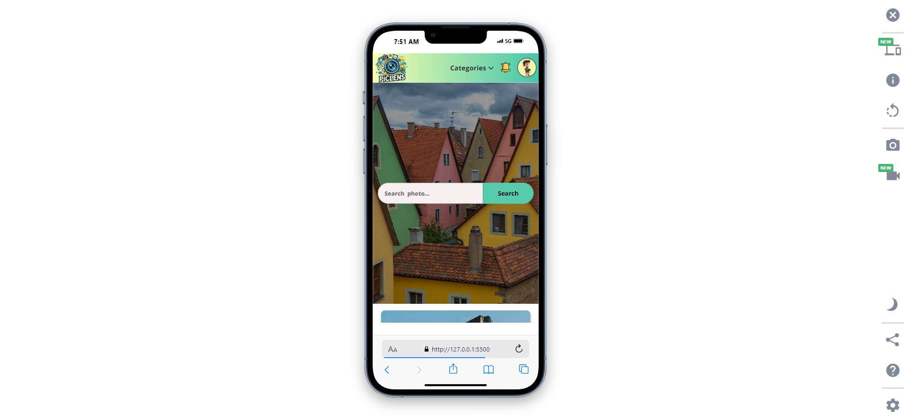

# 📸 **PicLens** - Photo Gallery Website

[](https://your-website-link.com)
[](https://developer.mozilla.org/en-US/docs/Web/JavaScript)
[](https://developer.mozilla.org/en-US/docs/Web/Guide/HTML/HTML5)
[](https://developer.mozilla.org/en-US/docs/Web/CSS)
[](https://unsplash.com/developers)
[](https://app.netlify.com/sites/pic-lens/deploys)
[](https://developer.mozilla.org/en-US/docs/Learn/CSS/CSS_layout/Responsive_Design)
[](https://github.com/Abdur-Rahman-Apu/PicLens)

Welcome to **PicLens** - an immersive photo gallery website where users can explore stunning images across various categories using the Unsplash API. 🌟

## 🌐 **Live Demo**

Check out the live demo of PicLens [here](https://pic-lens.netlify.app/) 🚀.

## 🚀 **Features**

- 🔍 **Category-Based Photo Selection**: Users can search 9 categories photos: **Animals**, **Nature**, **Experimental**, **Technology**, **Food**, **Travel**, **Rising Stars**, and **Films**.
- 🔄 **Dynamic Photo Fetching**: Photos are fetched dynamically from the **Unsplash API**.
- 🖼️ **Paginated Gallery**: Each page displays **12 photos**, and users can navigate up to **five pages**.
- 🔍 **Search Functionality**: Users can search for any photo using relevant keywords.
- 💻 **Fully Responsive**: The gallery adapts to different screen sizes for a flawless experience across devices.

## 📷 **Categories Available**

| Category         | Description                                                |
| ---------------- | ---------------------------------------------------------- |
| **Animals**      | Photos of animals in their natural habitat                 |
| **Nature**       | Stunning landscapes and natural elements                   |
| **Experimental** | Creative and unique experimental photography               |
| **Technology**   | Images of technology, gadgets, and more                    |
| **Food**         | Mouthwatering shots of food and beverages                  |
| **Travel**       | Explore the beauty of the world through travel photography |
| **Rising Stars** | Featuring the work of rising photography stars             |
| **Films**        | Cinematic shots and film photography                       |

## 🛠️ **Technologies Used**

- **HTML5**: For the structure of the web pages.
- **CSS3**: For styling and making the website responsive.
- **JavaScript**: For dynamic content and API integration.
- **Unsplash API**: To fetch high-quality photos for the gallery.

## 📂 **Project Structure**

```bash
📁 PicLens
└── 📁 assets
   └── 📁 JS
      └── 📁 modules
         └── 📁 ajax          # API request
         └── 📁 config        # Configuration
         └── 📁 db            # Storage
         └── 📁 elements      # HTML elements
         └── 📁 handlers      # Event Handlers
         └── 📁 init          # Initial function
         └── 📁 listeners     # Event listeners
         └── 📁 photo         # Photo related
         └── 📁 ui            # DOM update
         └── 📁 utilities     # Utility functions
      ├── 📄 app.js           # Main js file
└── 📁 Styles                 # css files
└── 📄 index.html             # HTML file
```

## 🖼️ **Screenshots**

Here are a few snapshots of **PicLens** in action:

### 🖥️ **Desktop View**


### 📱 **Mobile View**



## 📝 **Setup Instructions**

To run this project locally, follow these steps:

1. **Clone the repository**:

   ```bash
   git clone https://github.com/Abdur-Rahman-Apu/PicLens.git
   ```

2. **Navigate to the project folder**:

   ```bash
   cd PicLens
   ```

3. **Open `index.html` in your browser** to view the gallery.

## 🎯 **Project Overview**

- **Project Name**: PicLens
- **Version**: 1.0
- **Languages**: HTML, CSS, JavaScript
- **API**: [Unsplash API](https://unsplash.com/developers)
- **Features**: Photo search, category-based photo fetch, pagination, and responsive design.

## 🙏 **Acknowledgements**

A big thank you to the amazing community at [Unsplash](https://unsplash.com/) for providing high-quality images via their API and to [MDN Web Docs](https://developer.mozilla.org/) for excellent documentation on HTML, CSS, and JavaScript.

## ⭐ **Request for Star**

If you find this project useful, please consider giving it a ⭐ on GitHub! Your support will encourage me to continue improving the project and developing more exciting web applications.

[](https://github.com/Abdur-Rahman-Apu/PicLens)

## 🛡️ **License**

This project is licensed under the **MIT License** - see the [LICENSE](./LICENSE) file for details.

---

### 🌍 **Connect with Me**

[](https://www.linkedin.com/in/abdur-rahman-apu/)
[](https://github.com/Abdur-Rahman-Apu)

---
